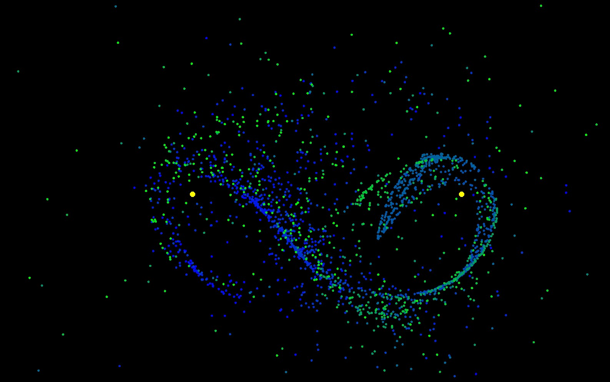

# simple-gravity-sim
Simple gravity simulation using C++ and SFML library.

### Windows Powershell execution:

Enter the src directory:

```PS ...> cd src```

Compile:

```PS ...> mingw32-make```

Execute:

```PS ...> ./main.exe```

### Sample images:





### Helpful tutorial series:
https://www.youtube.com/watch?v=oTWnV5su3m0

\[Project created in October 2024\]